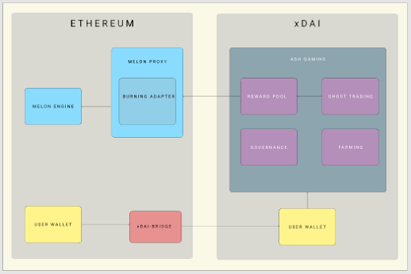

# Funding Proposal to the Melon Council DAO by Ash

### Abstract

The Ash Ðapp provides gamified crypto trading and yield farming on Ethereum and xDai. After launching Ash Beta in 2019, the team has 
further developed the concept and integrated extended functionalities with potential for higher user numbers and traffic for the Melon 
engine. Based on this assumption, the team submits a second MLN funding proposal to the Melon community in order to finish development 
and ultimately launch Ash on the Ethereum mainnet. Converting Ash into a decentralized application, the Ðapp will be fully in the hands 
of the Melon community after completion of the proposed development plan. This is supposed to drive developers’ engagement in the Ðapp 
and secures long term value for the entire network.

## 1. Product Descripton

### 1.1 Overview

The Ash Ðapp gamifies investing. The decentralized app uses the Melon protocol to provide users with a new way to engage in crypto asset 
management and yield farming. By implementing a ghost trading system that allows users to stake gaming currency (gDAI) in simulated trades 
of crypto assets, users can generate revenues through a crypto trading application without being exposed to varying network costs and 
processing times. Being integrated with the Melon protocol, high usage of the Ðapp automatically leads to stimulation of the Melon engine, 
i.e. continuously drives deflation of the MLN token.

### 1.2 gDAI: Ghost Trading

When using Ash for the first time users get asked to exchange DAI for gDAI, the internal Ðapp stable coin. This is always a 1:1 trade. 
Being owner of gDAI a user is now able to engage in a new fast and inexpensive form of crypto trading: ghost trading. This specially 
developed Ethereum-xDai hybrid system allows users to trade any simulated asset on the xDai Chain, a stable payments blockchain designed 
for fast and inexpensive stable transactions. To perform trades on xDai users just need to lock their gDAI.

The nature of xDai and simulated assets allows Ash to provide users with any crypto asset they desire. This means that an Ash portfolio 
can consist of BTC, ETH, MLN e.g. at the same time. Because all trades on xDai and therefore the user’s portfolio performance are purely 
‘simulated’, there are no actual value losses or gains in a user’s portfolio. In order to monetize a portfolio’s performance users can 
play challenges with each other by staking gDAI. Selecting the type of a challenge, a timeframe and the active staking amount users are 
free to send challenge requests or accept such. The winner earns all staked gDAI.

For example:

User A joins Ash and exchanges 5 DAI for 5 gDAI. Now user A challenges user B and stakes 3 gDAI. User A wins the challenge and receives 
6 gDAI as challenge reward. He now owns 8 gDAI. If User A now converts gDAI back into DAI, User A would have gained 3 DAI (for the sake 
of simplicity this example leaves out platform fees charged for every challenge, which are further described in 1.4).

On top of staking gDAI, each challenge, depending on the final result (win, lose, draw), will make users win or lose experience points 
(XP) which feed the user ranking on Ash. The more XP a user has the higher the position in the ranking. It is updated based on the results 
of every challenge played. In order to stay on top of the ranking, top users need to constantly play challenges and win or they will get 
replaced by better players. The XP mechanism and ranking score are based on the chess ELO system algorithm.

### 1.3 SHIVERS: Yield Farming

Apart from staking gDAI in order to play challenges, another integral function is staking gDAI to farm SHIVERS tokens. SHIVERS itself 
does not have any value but comes with a set of functions that are beneficial to Ash users. The main function is the right to create 
tournaments on Ash. Tournaments are challenge events that require a certain number of players (at least 4) who play against each other 
until a winner is set. Depending on the amount of gDAI staked before the launch of the tournament, a participant has the chance to win 
a relatively higher amount compared to a normal challenge. Owning sufficient SHIVERS to create a tournament, a user is free to set the 
parameters of the event like number of participants, tournament fee (to be paid by all participants in gDAI), duration etc. 
The tournament creator is also free to charge a certain percentage of the overall tournament fee. In this way, users can earn a passive 
income and monetize their SHIVERS.

The more gDAI is staked by a user the more SHIVERS get farmed i.e. the more tournaments can be created by this user. The size of the 
tournament (number of participants) also depends on the amount of SHIVERS a user possesses. Whenever SHIVERS is used to create an event, 
this amount of SHIVERS is burned and thereby reduces a user’s stack of SHIVERS. Apart from tournament creation, SHIVERS unlocks a set of 
advanced features to their holders like group challenges, clan and tribe features, higher visibility of their own created challenges in 
the home screen, and other challenge forms that allow users to earn passive income from spending their SHIVERS.

### 1.4 ASH: Governance & Royalties

ASH is a governance token that enables users, in combination with an activity-based governance formula to vote and take part in the Ash 
platform governance. Ash is a purely decentralized application without any central legal entity maintaining the platform or making strategic 
decisions with regards to the further development of it. Midas Technologies AG, the legal entity currently developing Ash, will step back 
and give control to the community at the very moment Ash is launched on the Ethereum mainnet. From this point on, ASH will be crucial in 
order to control further development and receive payouts from the platform gains.

*Ash Profits & Royalties:*

For every challenge played on Ash a service fee is charged that is paid by the winner. Half of these fees go directly to the Melon engine 
and thereby drive the MLN deflation mechanism (details in 1.5). The remaining 50% are sent to the Ash Rewards Pool and resemble (together 
with all other potential fees) the Ðapp’s income. This Rewards Pool is under no central control but all ASH holders. In order to receive 
payouts from the Rewards Pool, ASH holders need to lock their ASH. The amount of payouts a user is entitled to is composed by the amount 
of ASH the user holds.

Payouts from the Rewards Pool happen periodically and the payout schedule is ultimately decided upon by the Ash governance. ASH is a non-
inflationary token with a fixed total supply of 20 million. Before handing the platform over to the community, Midas Technologies AG will 
mint the total supply of ASH, keep 50% in its treasury to ensure a revenue stream to contribute to the further development of Ash and 
airdrop the other 50% to the first users. The ASH token will not be listed in any exchange by Midas Technologies AG.

*Ash Governance:*

All ASH holders are part of the Ash governance system and have the right to participate in decision-making with regards to technical 
development, additional features, royalty and payout settings, challenge commissions and so forth. The voting rights a user has is 
determined by the amount of ASH token holdings multiplied by a factor named “Voting Leverage” (VL) which takes into account their 
commitment in the use of the Ðapp and it’s described as:

Voting Rights = Ash Tokens Holdings * (1+ VL) 

Where,

VL = Challenges Played Ratio * 200% + Amount Staked Ratio * 140% + SHIVERS Farmed Ratio * 60%.

• Challenges Played Ratio = Challenges Played by user / Total Challenges Played in the Ðapp.

• Amount Staked Ratio = Amount Staked in Challenges played by user / Total Amount Staked in all Challenges in the Ðapp.

• SHIVERS Farmed Ratio = SHIVERS farmed by user / Total SHIVERS farmed in the Ðapp.

Thanks to this design, a user’s voting rights can increase according to his engagement with the Ðapp. In order to vote in the Ash 
governance ASH holders need to lock their ASH.

### 1.5 Melon Protocol Integration (Token use)

Ash was created as a Melon protocol-based product with the goal to make Melon more accessible to retail investors and thereby expand 
the potential user base. The past years have shown that transaction costs and times on Ethereum vary significantly which does not 
necessarily pose severe problems to Melon fund owners with thousands of USD as AUM. However, in order to achieve mainstream usage of 
Ash and Melon these variations do have a barrier effect. Hence, Ash is developed in a way that minimizes network frictions while 
fully contributing to the MLN deflation mechanism. This is achieved through our *Melon Proxy*.

This design allows that not every user needs to set up a Melon fund and rely on Ethereum parameters. Ash is the single owner of one 
Melon fund that is linked between every user and potentially payable actions. For the beginning the most important interactions are 
challenges played by users. Challenge fees are split by half: 50% go into the Ash Rewards Pool and 50% are used to trigger the Melon 
engine. User and usage of Ash and the amount of played challenges in particular, are directly connected to the Melon engine penetration 
by the Melon Proxy and thereby contribute to MLN deflation.

## 2. The current team

The company behind this proposal is Midas Technologies AG, software developer based in the Crypto Valley Zug, Switzerland. The Midas 
team currently consists of 7 people working on the development of Ash. The main part of the team has been working together at Midas 
Technologies since 2017 integrating and developing on the Melon protocol.

**[Adrian Gallo](https://www.linkedin.com/in/adrian-j-gallo-8a679028/)**, Co-founder & CEO

**[Konstantin Trott](https://www.linkedin.com/in/konstantin-trott-92783b101/)**, Co-founder & COO

**[Philipp Doğan](https://www.linkedin.com/in/philipp-do%C4%9Fan-671441b6/)**, Co-founder & CTO

**[Horacio Raviolo](https://ar.linkedin.com/in/horacioraviolo)**, Product Lead

**[Kunal Sachdeva](https://www.linkedin.com/in/kunsachdeva/)**, Front-end Developer

**[Thomas Bach](https://www.linkedin.com/in/thomas-bach-5bb470148/)**, Smart Contract Back-end Developer

**[Timon Kritenbrink](https://www.linkedin.com/in/thomas-bach-5bb470148/)**, Information Security Engineer

Additional developers to be added to the team according to section 8 (Product development).

## 3. Our Advisors

**Mona El Isa**, Avantgarde Finance Ltd.

Former star-trader at Goldman Sachs, promoted to Vice President by the age of 26 and made the “top 30 under 30” list in Trader Magazine 
in 2008 and Forbes Magazine in 2011 after profitably trading the 2008 and 2011 crashes. Moved to Geneva-based macro fund Jabre Capital 
in 2011, before deciding in 2014 that the future of finance lay in blockchain technology. She studied Economics & Statistics at the 
University College London.

**Thomas Linder**, MME Legal | Tax | Compliance

Thomas Linder joined MME in 2015. He is particularly specialized in leading interdisciplinary projects and has in-depth knowledge in 
cross-border transactions and tax accounting. At present, he mainly provides assistance to companies in the technology sector, with a 
focus on blockchain technology and international projects.

## 4. The Mission

The Ash mission consists of three elements:

• **MLN deflation**: While the Melon protocol acts as a solution to all complex technical challenges of setting up a decentralized fund 
management infrastructure, our team set off to build an interface that drives usage of the protocol by utilizing it as core infrastructure 
behind the scenes. This means aiming at maximum penetration of the Melon engine i.e. deflation of MLN while enhancing the protocol with 
attractive gaming functionalities. In order to achieve the former in a time efficient way, it is our mission to launch Ash on the Ethereum 
mainnet as soon as possible. Constantly adding gaming features, staking and farming functionalities will attract new user groups currently 
unaware of Melon, which again will lead to higher usage i.e. accelerate the MLN deflation process.

• **Open sourcing**: In order to continuously add new features and develop the Ðapp in a user centric way, we plan to open source the Ash Ðapp 
audit code for the Melon community and invite all Melon developers to further develop Ash and expand the features. This way the community 
itself ensures a steady development of the Ðapp and potential adaptation to market or technology changes. By open sourcing the code we also 
seek to arouse interest of developers outside of the Melon community in order to win long term community members and innovation drivers. 
Ultimately, open sourcing our code will ensure transparency and will therefore create trust among users and all other involved parties.

• **Decentralization**: After developing and launching v.1.0 of Ash on the Ethereum mainnet it is our plan to step back as a single entity 
behind the project and hand it over to the community. By fully decentralizing the Ash governance as well as granting the possibility to 
receive parts of the revenues generated by Ash, we seek to drive motivation of developers as well as users to participate in the development 
process and create value for Ash and the Melon community. Executing this democratic step, we see Ash maximally aligned with the decentralized 
and democratic spirit of the Melon protocol and the Melon community. As the biggest “investor” or source of funding for Ash, we see it as 
crucial for the Melon community to have a say in future strategic decisions. Ultimately, we believe that everybody who contributes or 
interacts with Ash will receive the fair opportunity to benefit from the success of the project.

## 5. How we bring value to the Melon Ecosystem

Our mission is the gamification of mechanics around Melon in order to drive user adoption and Melon engine activity. **All gaming interactions 
on Ash cost Melon gas and get channeled through a Melon proxy fund.** This creates a direct link between the Ðapp’s usage and the Melon engine. 
Usage of Ash will increase the MLN burn rate and thereby contribute to the MLN purchasing power (detailed information about the Melon Engine 
and MLN deflation in [Melonomics II](https://medium.com/melonport-blog/melonomics-part-2-the-melon-engine-48bcb0dae65)).

### 5.1 Deflation of MLN

Our goal is to expand the user base and actively increase the MLN engine burn rate by providing:

- a new innovative use-case to Melon: ghost trading, a gamified financial product that lets users trade any asset in simulated trades by staking 
gDAI in challenges.

- farming: stake gDAI to farm SHIVERS to receive access to additional features and functionalities

The new Ash financial product ghost-trading and rewards pool work as incentive mechanisms to drive broader adoption. The more users play challenges 
or tournaments, the more fees get paid, therefore the more MLN is burnt. Every user joining Ash will connect to the global proxy Melon fund managed 
by the Ash governance model. Every challenge played will trigger a Melon gas payment in the global proxy fund thus increasing the MLN burn rate 
while lowering the entry barrier for users to join the game by removing the high cost to create a Melon fund.

### 5.2 User Base & Profit Pool Projection

With launching Ash Beta in early 2019 we already received more than 1,200 signups of potential Ash users. For another increase of this user base 
prior to the mainnet launch an ASH and gDAI airdrop will be announced and performed 4 to 6 weeks before the app launch. This way we deem it 
realistic to increase the initial quantity of users by another 1,800 and start off with around 3000 users in the first month. We plan to do 
additional airdrops in order to increase the user base and keep them active. At the same time we also expect a certain number of monthly dropouts 
of users who discontinue using Ash. Hence, for the following projection we calculated conservatively and projected a monthly user growth of 10% 
from month 1.

Revenue starts to boost when more challenges are played and the staked amount increases.

In a three years conservative projection, we estimate that Ash will be able to burn all MLN tokens requested in this proposal already at the end 
of the second year, and from that moment forward to burn an estimate of 15.000 MLN tokens per year at current price if the same gaming conditions 
and user base are held.

ASH token holders will be entitled to claim their revenue periodically.

### 5.3 Other benefits to the Melon community

Ash will be the first Ðapp created on Melon with governance and open source code, which will likely inspire other projects to choose the same path. 
Ash will also increase awareness for Melon, which will potentially lead to more created funds on the protocol. Today there are 334 active funds on 
the protocol. Ash will start off with around 3000 users.

## 6. Next Steps

• *Ash2.0 Ðapp*: Browser Ðapp on Melon protocol with xDai gaming stack offering users ghost- trading and traditional farming.

• *Ash bridge adapter*: Add a bridge adapter for the Melon protocol that enables our proxy fund to connect to our xDai gaming system.

• *DAI - Ash bridge*: Bridge contract that enables users to swap DAI for gDAI on xDAI for staking/mining.

• *xDai gaming system*: Implementation of ghost-trading on xDai.

## 7. What we need from the Melon Council

In March 2019, Midas Technologies AG released a [first proposal to the Melon Council](https://medium.com/ash-blog/proposal-for-a-token-application-event-to-the-melon-council-5ed2cc4eefd5) 
aiming to obtain funding for developing Ash. The total amount budgeted and requested in that proposal was CHF 1.090.000. Consequently, 150.000 MLN 
tokens were granted by the council in three steps, which were sold OTC to private investors in the following twelve months at an average price of 
CHF 4.47 per token and reported to Midas an inflow of approx. CHF 670.000. Unfortunately and due to detrimental market conditions, these funds were 
not sufficient to finalize the product and materialize our vision. In order to be able to further develop and ultimately launch successfully the 
Ash Ðapp we will need a second and last financial assistance of **CHF 420.000**, which represents the remaining funds that were not possible to obtain 
by selling MLN tokens granted in the first proposal. We are confident that this new approach given to Ash will definitely speed up the usage of 
Melon and play a fundamental role in the Melon engine feed. If granted, we plan to spend the requested funds as follows:

**CHF 294,000 Product Development (70%)**

- 6 full-time product developers: CTO, front-end, back-end (2), UX design, information security engineer.

- 3 admin for project management & marketing, company administration, accounting.

**CHF 84.000 Community & Marketing (20%)**

- Airdrop Phase I to get users on board.

- Airdrop Campaign to retain and add more users.

- Rewards program to people that bring more users into the Ðapp (referral code).

- Marketing Campaign on Twitter / Telegram & other SM to attract more users.

- Invitations to top Traders (influencers) to tournaments or challenges sponsored by Ash.

**CHF 21.000 Administration & Maintenance (5%)**

- Administration costs.

- Legal advice.

- Work related materials.

- Office rent.

**CHF 21.000 Contingency (5%)**

- Any unforeseen costs.

**Funds Distribution:**

## 8. Funding Schedule & Milestones

| Time                         | Amount       | Milestones                                                                                                                                                                                                                                                                                                                                                                                                                                                                                                                                                                        |
|------------------------------|--------------|-----------------------------------------------------------------------------------------------------------------------------------------------------------------------------------------------------------------------------------------------------------------------------------------------------------------------------------------------------------------------------------------------------------------------------------------------------------------------------------------------------------------------------------------------------------------------------------|
| **1**   Mar-May   2021 | **210k CHF** | *Main Milestones:*    **Development of Ash Ðapp staking and transactions contract**    -  Development of DAI - Ash contract   -  Development of Ash adapter for the Melon protocol   -  Testing of DAI - Ash contract and Ash adapter    **Development of Ðapp interface**    -  Development of stable coin staking   -  Development of Ash adapter integration   -  xDai bridge integration    *General development:*    -  Ash - xDai bridge contract   -  Governance modules architecture                                   |
| **2**   Jun-Aug   2021 | **210k CHF** | *Main Milestones:*    **Development of Ash gaming system on xDai**    -  xDai gaming contracts   -  Ash - xDai Bridge contract   -  Testing of eth-xdai bridge   -  Testing of xDai gaming system    **Development of Ash governance**    - Ash governance contracts   - Governance/Ash pool-bridge contract   - Testing of governance system    **Ash Ðapp Launch &   Open source release of Ash React Ðapp**    -  Launch Ash Ðapp   -  Open source release Ash Ðapp   -  Documentation   -  Published on Github |

## 9. Treasury Management
The sell schedule for the granted MLN will be aligned with the funding and milestones schedule cited above. In this regard, to cover 
our development and administration costs, we would start selling MLN tokens OTC via Woorton from February to July 2021 in order to 
obtain CHF 52,500 per month. Once our second milestone is fully achieved, we would sell the remaining MLN tokens to be able to perform 
our marketing campaign.

## 10. Additional Sources of Information

[Website](https://ash.finance/)

[Github](https://github.com/Midas-Technologies-AG)

[Medium](https://medium.com/midas-app)

[Twitter](https://twitter.com/ash_app)

[Telegram](https://t.me/ash_app)

Email us: hi@Ash.finance
